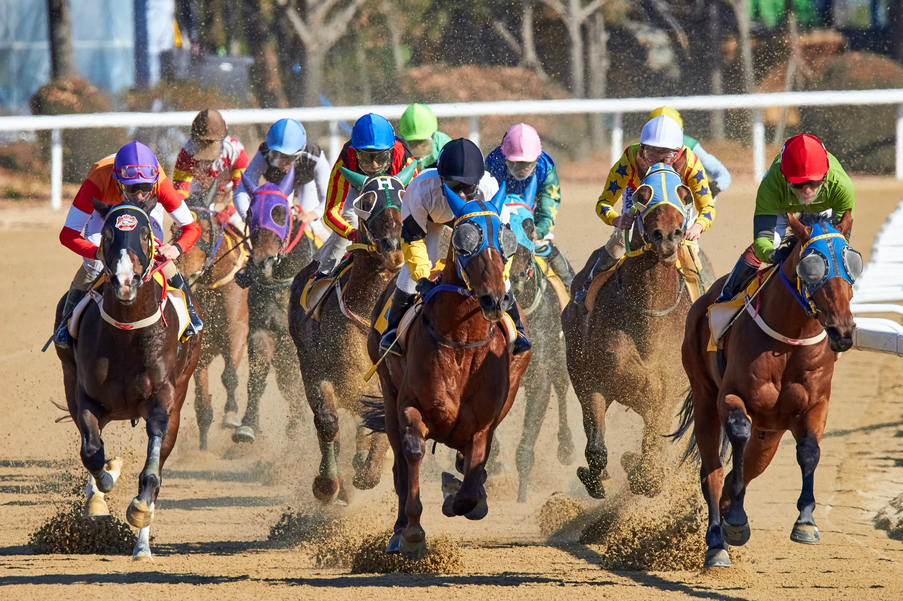

<html>
<head>
<meta charset="utf-8">

<link href="https://stackpath.bootstrapcdn.com/font-awesome/4.7.0/css/font-awesome.min.css" rel="stylesheet">
<link href="https://pro.fontawesome.com/releases/v5.10.0/css/all.css" type="text/css" rel="stylesheet">
<link href="https://stackpath.bootstrapcdn.com/font-awesome/4.7.0/css/font-awesome.min.css" rel="stylesheet">
</head>

<body>

	<ul>
    	<li>Home</li>
        <li>About</li>
        <li>Services <i class="fa fa-angle-down"></i>
        <ul>
            	<li>Horse Farming <i class="fa fa-angle-right"></i>
                <ul style="margin-left:150px; margin-top:-50px;">
                <li>Horse Riding</li>
                <li>Horse Care</li>
                <li>Horse Racing</li>
                </ul>
                </li>
            </ul>
        </li>
        <li>Contact</li>
    </ul>

 

	

horse farming

     
    
<h3>Horses are used for riding and transport. They are also used for carrying things or pulling carts, or to help plow farmer's fields in agriculture. People have used selective breeding to make bigger horses to do heavy work. They are still used for work and transportation in some places, such as where there are no roads.</h3>

horse farming

	<input type="text" name="search" placeholder="Search..">

 

	
    

	
<h1>O U R  &nbsp; S E R V I C E S</h1>  
    
    
Our services are very different as compare to other farmhouses, we care alot our horses & our clients happy with us always, we never give them a chance to any type of complain.

    

	

    	<i class="fas fa-headset"></i>
        <h2>24/7 Service</h2>
        
This is our service number one

        

        
        

    	<i class="fas fa-clock"></i>
        <h2>Our Time Management</h2>
        
This is our service number two

        

        
        

    	<i class="fas fa-hospital-user"></i>
        <h2>Customer Care</h2>
        
This is our service number 3

        

        
        

    	<i class="fas fa-layer-group"></i>
        <h2>Web Designing</h2>
        
This is our service number four

        

        
        

    	<i class="fas fa-apple-alt"></i>
        <h2>IOS Development</h2>
        
This is our service number five

        

        
        
        

        <i class="fab fa-android"></i>
        <h2>Android Development</h2>
        
This is our service number six

        

    
	

<h4 style="font-weight:lighter; font-size:40px; margin-left:200px; color:#333; font-weight:500; margin-top:100px; font-family:sans-serif;">O U R  &nbsp; P R O J E C T S  &nbsp; & &nbsp;  W O R K</h4>
    
    
Our workers are very honest instead of other employees, we care alot our horses & our clients happy with us always, we never give them a chance to any type of complain.

    

 

<section style="max-width:100%; margin-left:100px; margin-right:-100px; margin-top:20px; font-family:"montserrat",sans-serif;">

   
  <h4 style="font-family:Montserrat, Sans-serif; color:#333; font-weight:lighter; border-bottom: 3px solid #333; border-width:4px; display:inline-block; margin:15px; font-size:x-large;">HORSE RACING</h4>
  
We have created a fictional band website. Lorem ipsum dolor sit amet, consectetur adipiscing elit, sed do eiusmod tempor incididunt ut labore et dolore magna aliqua. Ut enim ad minim veniam, quis nostrud exercitation ullamco laboris nisi ut aliquip ex ea commodo consequat. Duis aute irure dolor in reprehenderit in voluptate velit esse cillum dolore eu fugiat nulla pariatur. Excepteur sint occaecat cupidatat non proident, sunt in culpa qui officia deserunt mollit anim id est laborum consectetur adipiscing elit, sed do eiusmod tempor incididunt ut labore et dolore magna aliqua.

</section>

 
 

<section style="max-width:100%; margin-left:100px; margin-right:-100px; margin-top:20px; font-family:"montserrat",sans-serif;">

   
  <h4 style="font-family:Montserrat, Sans-serif; color:#333; border-bottom: 3px solid #333; font-weight:lighter; border-width:4px; display:inline-block; margin:15px; font-size:x-large;">HORSE FARMING</h4>
  
We have created a fictional band website. Lorem ipsum dolor sit amet, consectetur adipiscing elit, sed do eiusmod tempor incididunt ut labore et dolore magna aliqua. Ut enim ad minim veniam, quis nostrud exercitation ullamco laboris nisi ut aliquip ex ea commodo consequat. Duis aute irure dolor in reprehenderit in voluptate velit esse cillum dolore eu fugiat nulla pariatur. Excepteur sint occaecat cupidatat non proident, sunt in culpa qui officia deserunt mollit anim id est laborum consectetur adipiscing elit, sed do eiusmod tempor incididunt ut labore et dolore magna aliqua.

</section>

 
 

<section style="max-width:100%; margin-left:100px; margin-right:-100px; margin-top:20px; font-family:"montserrat",sans-serif;">

   
  <h4 style="font-family:Montserrat, Sans-serif; color:#333; border-bottom: 3px solid #333; font-weight:lighter; border-width:4px; display:inline-block; margin:15px; font-size:x-large;">HORSE RIDING</h4>
  
  
We have created a fictional band website. Lorem ipsum dolor sit amet, consectetur adipiscing elit, sed do eiusmod tempor incididunt ut labore et dolore magna aliqua. Ut enim ad minim veniam, quis nostrud exercitation ullamco laboris nisi ut aliquip ex ea commodo consequat. Duis aute irure dolor in reprehenderit in voluptate velit esse cillum dolore eu fugiat nulla pariatur. Excepteur sint occaecat cupidatat non proident, sunt in culpa qui officia deserunt mollit anim id est laborum consectetur adipiscing elit, sed do eiusmod tempor incididunt ut labore et dolore magna aliqua.

</section>

 
 

	    
    

    	<h4><i>
HORSE RIDING
</i></h4>
         

        
A riding horse or a saddle horse is a horse used by mounted horse riders for recreation or transportation. It is unclear exactly when horses were first ridden because early domestication did not create noticeable physical changes in the horse.

        

          
         
        <h4><i>
HORSE MANAGEMENT
</i></h4>
         

        
There are many aspects to horse management. Horses, ponies, mules, donkeys and other domesticated equids require attention from humans for optimal health and long life.

        

         
    

    
    

	
<b>Q. What is a riding horse called?</b> 
    
Ans:
 Equestrianism (from Latin equester, equestr-, equus, 'horseman', 'horse'), commonly known as horse riding (British English) or horseback riding (American English), includes the disciplines of riding, driving, or vaulting with horses.

	
    
    

    	<h4><i>
HORSE CARE
</i></h4>
         

        
<ul>
        		Daily Stable Management and Horse Care Routine
					<li>Feed horses hay and/or grain morning and night.</li>
					<li>Clean and refill water buckets morning and night.</li>
					<li>Muck out stalls morning and night.</li>
					<li>Replace fresh bedding.</li>
					<li>Check and pick out hooves daily.</li>
					<li>Remove blankets in the morning and replace in the evening during winter months.</li>
           </ul>
       

        

          
         
        <h4><i>
HORSE NEED
</i></h4>
         

        

They need daily care. Provide your horse with fresh clean water. Clean, readily available water is essential for good horse care. Provide your horse with adequate fodder and concentrates. If feeding hay, your horse will eat approximately two to three percent of its body weight every day.

        

         
    

    
    

	
<b>Q. What is a riding horse called?</b> 
    
Ans:
 Equestrianism (from Latin equester, equestr-, equus, 'horseman', 'horse'), commonly known as horse riding (British English) or horseback riding (American English), includes the disciplines of riding, driving, or vaulting with horses.

	
    
    

    	<h4><i>
HORSE CARE
</i></h4>
         

        
<ul>
        		Daily Stable Management and Horse Care Routine
					<li>Feed horses hay and/or grain morning and night.</li>
					<li>Clean and refill water buckets morning and night.</li>
					<li>Muck out stalls morning and night.</li>
					<li>Replace fresh bedding.</li>
					<li>Check and pick out hooves daily.</li>
					<li>Remove blankets in the morning and replace in the evening during winter months.</li>
           </ul>
       

        

          
         
        <h4><i>
HORSE NEED
</i></h4>
         

        

They need daily care. Provide your horse with fresh clean water. Clean, readily available water is essential for good horse care. Provide your horse with adequate fodder and concentrates. If feeding hay, your horse will eat approximately two to three percent of its body weight every day.

        

         
    

    
    

	
<b>Q. What is a riding horse called?</b> 
    
Ans:
 Equestrianism (from Latin equester, equestr-, equus, 'horseman', 'horse'), commonly known as horse riding (British English) or horseback riding (American English), includes the disciplines of riding, driving, or vaulting with horses.

	

    	<h1 style="font-family:Montserrat, Sans-serif; color:#333; font-weight:300; text-align:center;">O U R  &nbsp; M O D E R N &nbsp; L I F E </h1> 
    	
Our services are very different as compare to other farmhouses, we care alot our horses & our clients happy with us always, we never give them a chance to any type of complain Our services are very different as compare to other farmhouses, we care alot our horses & our clients happy with us always, we never give them a chance to any type of complain Our services are very different as compare to other farmhouses, we care alot our horses & our clients happy with us always, we never give them a chance to any type of complain.

         
         
        
<a href="#" target="_blank">View Our Work</a>

    

<footer class="footheading1">

  <a href="#" class="facebook"><i class="fa fa-facebook"></i></a>
  <a href="#" class="insta"><i class="fa fa-instagram"></i></a>
  <a href="#" class="twitter"><i class="fa fa-twitter"></i></a>
  <a href="#" class="google" class="right"><i class="fa fa-google"></i></a>

  horse farming  
	

     
&#169; 2020 All Rights Reserved. - Created By Sami-Siddiqui

    

</footer>

</body>
</html>
